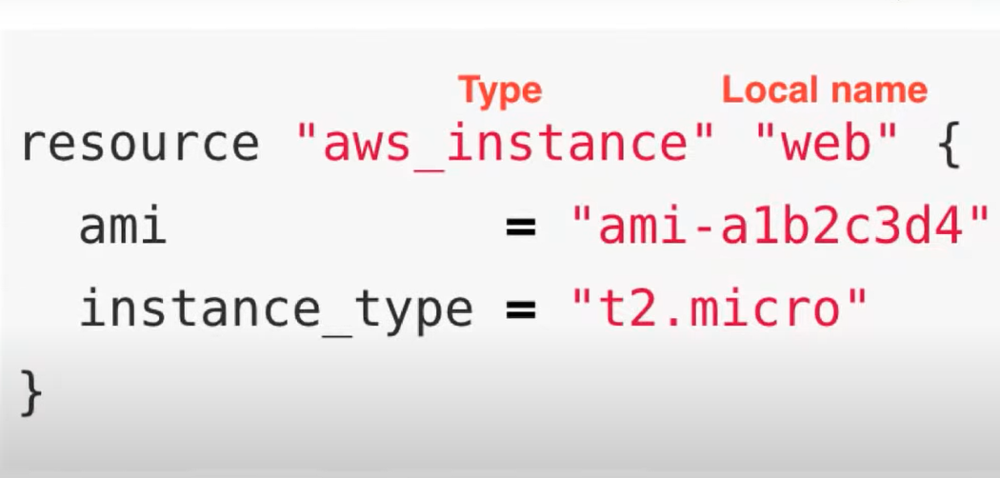
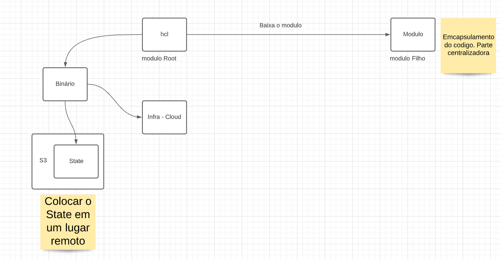

# **Treinamentos  Terraform**

Colocar ✔ quando concluído. 

## ✔ Descomplicando o Terraform | HashiWeek

- https://www.youtube.com/watch?v=8mRZJcCgoS0

- https://www.youtube.com/watch?v=lrAycU7_XnQ

  

##  ✔ Descomplicando o Terraform | HashiWeek
- https://www.youtube.com/watch?v=4FellihAcV8

  

## ✔ Lucas de Souza - Terraform além do básico | #FiqueEmCasaConf

- https://www.youtube.com/watch?v=P3aY4_vxzWQ&t=243s

- https://github.com/souzaxx/terraform-alem-do-basico

  

## LinuxTips - HASHICORP EXPERT

- Descomplicando Terraform

## Oficial - Hashicorp

### Configuration Syntax

- https://www.terraform.io/docs/language/syntax/configuration.html

- https://github.com/hashicorp/hcl/blob/main/hclsyntax/spec.md

  

- https://learn.hashicorp.com/terraform
- https://hashiconf.com/europe/workshops/
- https://www.youtube.com/c/HashiCorp/search?query=terraform
- https://learn.hashicorp.com/collections/terraform/modules
- https://learn.hashicorp.com/collections/terraform/kubernetes
- https://learn.hashicorp.com/collections/terraform/aws

## Acloudguru
- Deploying to AWS with Terraform and Ansible

  

# **Anotações**

**Remote State**

Mantem o estado do deploy.  Sempre quando vai atualizar ele verifica o local, verifica o remoto e aplica a diferença.

Dividir o state em lugares diferentes. 

**Dynamic Blocos**

Sempre utilizar 

**Workspaces**

Reutilizar o mesmo código para diversos ambientes

 

**terraform-cheatsheet**

https://res.cloudinary.com/acloud-guru/image/fetch/c_thumb,f_auto,q_auto/https://acg-wordpress-content-production.s3.us-west-2.amazonaws.com/app/uploads/2020/11/terraform-cheatsheet-from-ACG.pdf

**Hashicorp Configuration Language** (**HCL**)

**Bloco Data** - coletar uma informação - recurso que já existe no Provider

```yaml
# ---------------------------------------------------------------------------------------------------------------------
data "aws_ami" "consul" {
  most_recent = true  ## Sempre a informação mais recente

  # If we change the AWS Account in which test are run, update this value.
  owners = var.owners ## Pegue a AMI cujo o dono seja "var.owners"

  filter {
    name   = "virtualization-type"
    values = ["hvm"]
  }

  filter {
    name   = "is-public"
    values = ["false"]
  }

  filter {
    name   = "name"
    values = ["consul-ubuntu-*"]
  }
}
```

Local name não é o nome da maquina, mas sim o nome de referencia no terraform



# **Comandos Terraform**

https://www.terraform.io/docs/cli/commands/index.html


|                Comando                 | Descrição                                                    |
| :------------------------------------: | :----------------------------------------------------------- |
|           terraform **init**           | Inicializa o ambiente com o provider utilizado.Por exemplo, se você estiver utilizando o **provider "aws"**, inicializa o plugin para Amazon Web Services. |
|          terraform **apply**           | Este comando que cria e altera as Instâncias/Objetos no Provider de acordo com o seu terraform. |
|           terraform **plan**           | Mostra o plano de execução do terraform.                     |
|         terraform **destroy**          | Este comando para as Instâncias/Objetos em execução e destruindo todos os recursos que foram criados durante o processo de criação. |
|           terraform **show**           | Mostra um resumo do status da sua infraestrutura terraform.  |
|          terraform **output**          | Mostra um valor de uma variável output                       |
|      terraform **init -upgrade**       | Upgrade de pacotes                                           |
|      terraform **plan -destroy**       | informa o plano de destruição                                |
|   terraform **apply -auto-approve**    | Cria infra automático sem perguntar                          |
|        terraform workspace list        | Lista os workspaces                                          |
|      terraform workspace new dev       | cria novos workspaces                                        |
| terraform workspace select "workspace" | altera o workspaces                                          |
|      terraform plan **-out=out**       | Saída do arquivo plan                                        |
|                                        |                                                              |
|                                        |                                                              |
|                                        |                                                              |
|                                        |                                                              |
|                                        |                                                              |
|                                        |                                                              |

# **Best Pratices**


